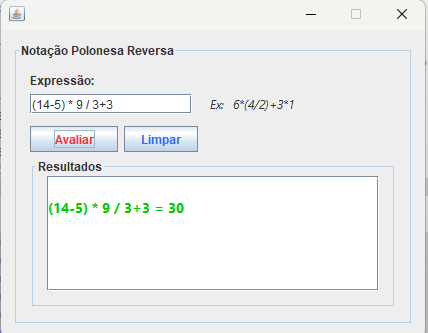
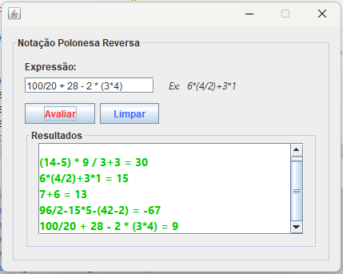

# notacao-polonesa-reversa
Teste técnico para avaliar expressões matemáticas com Notação polonesa reversa

## Sobre o Projeto

Este projeto implementa uma avaliador de expressoes matemáticas usando notação polonesa reversa.
Os critérios são:

- Avaliar e calcular expressões matemáticas
- Obedecer as regras de precedencia para mutiplicação, divisão, soma e subtração
- Obedecer a ocorrência de parênteses
- A análise deve ser feita da direita para a esquerda
- As operações devem ser empilhadas obedecendo a hierarquia das expressões
- Devem ser considerados apenas numeros inteiros e sem necessidade de arredondamentos

Exemplo: 6*(4/2)+3*1

Ao receber expressoes do tipo # / # + # ou # * # + # ou (# * #) / # - #. Deve ser analizado a regra de precedencia da esquerda para direita para execução da pilha de expressões.

## Pré-Requisitos
- Java 11
- Maven

## Como Rodar

Importar o projeto como Maven Project tanto no Intellij, Netbeans ou Eclipse
(Projeto originalmente feito no Netbeans)


`````
mvn clean install compile
`````

`````
mvn exec:java -Dexec.mainClass="com.wellalmeida31.notpolonesa/com.wellalmeida31.notpolonesa.NotPolonesa.class"
`````




